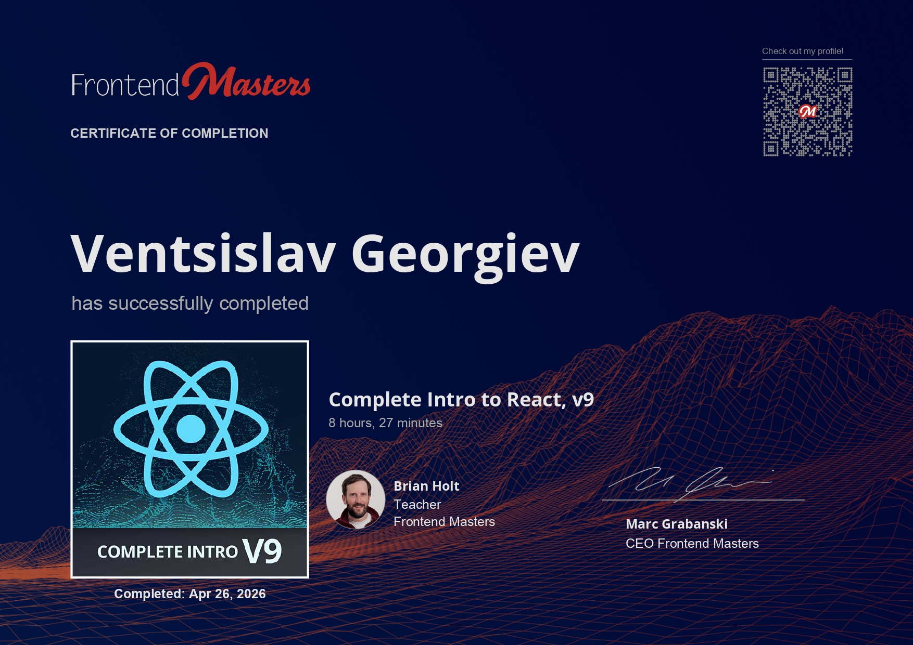

# Complete Intro to React, v9



## Course

This project follows the Frontend Masters course **Complete Intro to React, v9**.

Course link: <https://frontendmasters.com/courses/complete-react-v9/>

## Description

Build real-world applications with the modern APIs in React 18 and 19. Craft component UIs with JSX and make them come to life with hooks, effects, portals, and user-driven event handling. Explore the React ecosystem by leveraging TanStack Router, TanStack Query, and industry-standard tools like Vite, ESLint, and Prettier.

The course also covers testing fundamentals through unit tests, mocks, and browser-based tests with Playwright. Later sections upgrade the app to React 19 and use form actions, suspense, and performance optimizations with the React Compiler.

## Project Structure

The main React application is in:

```txt
02-tools/
```

The API is outside the main app, in:

```txt
api/
```

## Main App

The main application is a React + Vite project. It uses:

- React
- Vite
- TanStack Router
- TanStack Query
- Vitest
- Playwright

Run it from the `02-tools` folder:

```bash
cd 02-tools
npm install
npm run dev
```

## API

The backend API is a separate Node.js project using Fastify and SQLite.

Run it from the `api` folder:

```bash
cd api
npm install
npm run dev
```

## Notes

Both parts should usually be started separately:

1. Start the API from `api/`.
2. Start the React app from `02-tools/`.

This keeps the frontend and backend concerns separated while still allowing the app to talk to the local API during development.
