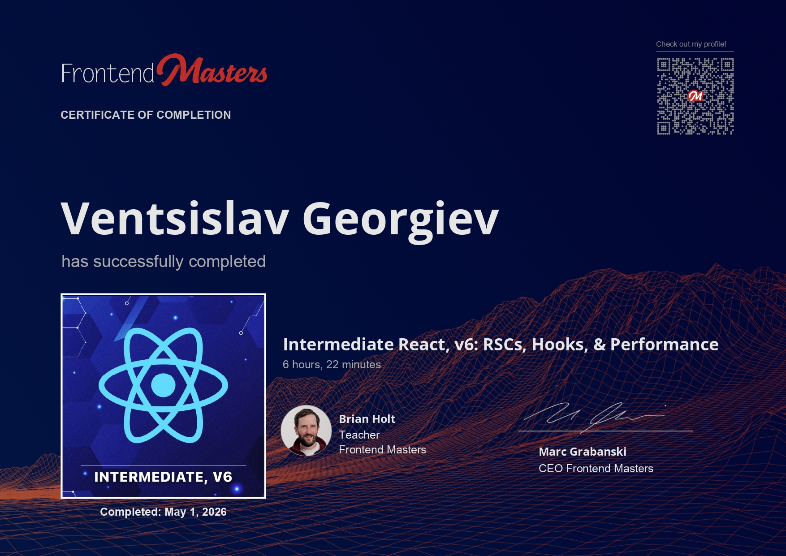

# Intermediate React, v6: RSCs, Hooks, & Performance



## Course

This project follows the Frontend Masters course **Intermediate React, v6: RSCs, Hooks, & Performance**.

Course link: <https://frontendmasters.com/courses/intermediate-react-v6/>

## Description

Master React 19 and build high-performance apps. This course explores how React Server Components work under the hood and how to use them with and without Next.js. It also covers render modes like static site generation and server-side rendering, then moves into performance-focused React patterns such as transitions, deferred values, optimistic updates, and framework-level bottlenecks.

The goal of this course is to level up React skills beyond the basics and build confidence with the patterns used in modern React applications.

## Project Structure

The course exercises are inside:

```txt
starter/
```

The certificate image is stored in:

```txt
certificate/
```

## Exercises

The `starter` folder contains several small projects focused on different React 19 and rendering concepts:

- `no-framework/` - React Server Components without a full framework, using Webpack, Fastify, SQLite, and `react-server-dom-webpack`.
- `next/my-note-app/` - a Next.js note app using React 19, Next 15, SQLite, and server-driven app patterns.
- `ssr/` - a small server-side rendering example with Vite and Fastify.
- `ssg/` - a simple static site generation example.
- `transitions/` - React transitions and UI responsiveness with Vite.
- `deferred/` - deferred values for smoother rendering during expensive updates.
- `optimistic/` - optimistic UI updates for faster-feeling interactions.
- `perf/` - performance experiments and bottleneck exploration.

## Running The Projects

Each exercise has its own `package.json`, so commands should be run from the specific project folder.

For most Vite examples:

```bash
cd starter/transitions
npm install
npm run dev
```

For the Next.js app:

```bash
cd starter/next/my-note-app
npm install
npm run dev
```

For the no-framework React Server Components example:

```bash
cd starter/no-framework
npm install
npm run dev:client
npm run dev:server
```

## Notes

This course is more focused on how React works at the rendering and performance level than on building one large app. Each folder is a separate experiment, making it easier to compare React Server Components, SSR, SSG, Next.js, and client-side performance patterns independently.
