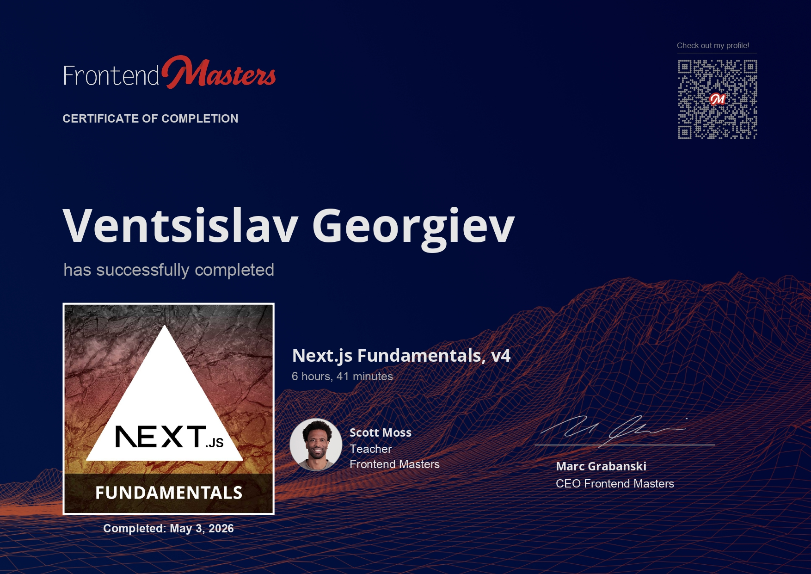

# Next.js Fundamentals, v4



## Course

This project follows the Frontend Masters course **Next.js Fundamentals, v4**.

Course link: <https://frontendmasters.com/courses/next-js-v4/>

## Description

Build high-powered applications with modern Next.js. This course focuses on React Server Components, Server Actions, static and dynamic routing, authentication, caching with `dynamicIO`, edge functions, API routes, testing, and deployment to Vercel.

The main project is a Linear-inspired issue management app that brings these concepts together in one full-stack Next.js application.

## Project Structure

The main course project is in:

```txt
next.js-fundamentals/
```

Additional course work and generated starter code is in:

```txt
todos/
```

The certificate image is stored in:

```txt
certificate/
```

## Main App

The main application uses:

- Next.js with the App Router
- React Server Components
- Server Actions
- TypeScript
- Tailwind CSS
- PostgreSQL with Drizzle ORM
- JWT-based authentication
- Middleware and API routes
- Vitest and Testing Library

## Features

- Marketing pages with static routing
- Auth flows for sign up, sign in, and sign out
- Protected dashboard routes
- Issue creation, editing, and deletion
- Dynamic issue detail pages
- Server-side data fetching and caching patterns
- API endpoints protected by middleware
- Edge function examples
- Vercel deployment workflow

## Running The Project

Run the main app from the `next.js-fundamentals` folder:

```bash
cd next.js-fundamentals
npm install
npm run dev
```

The app expects environment variables for the database and authentication:

```txt
DATABASE_URL=
JWT_SECRET=
```

After configuring the database, push the schema and optionally seed demo data:

```bash
npm run db:push
npm run seed
```

## Testing

Run the test suite from the main project folder:

```bash
npm test
```

## Notes

This course builds on React fundamentals by showing how Next.js application features fit together in a production-style project. The biggest focus areas are understanding the server/client boundary, using Server Actions for real workflows, protecting data, and deploying a full-stack Next.js app with confidence.
