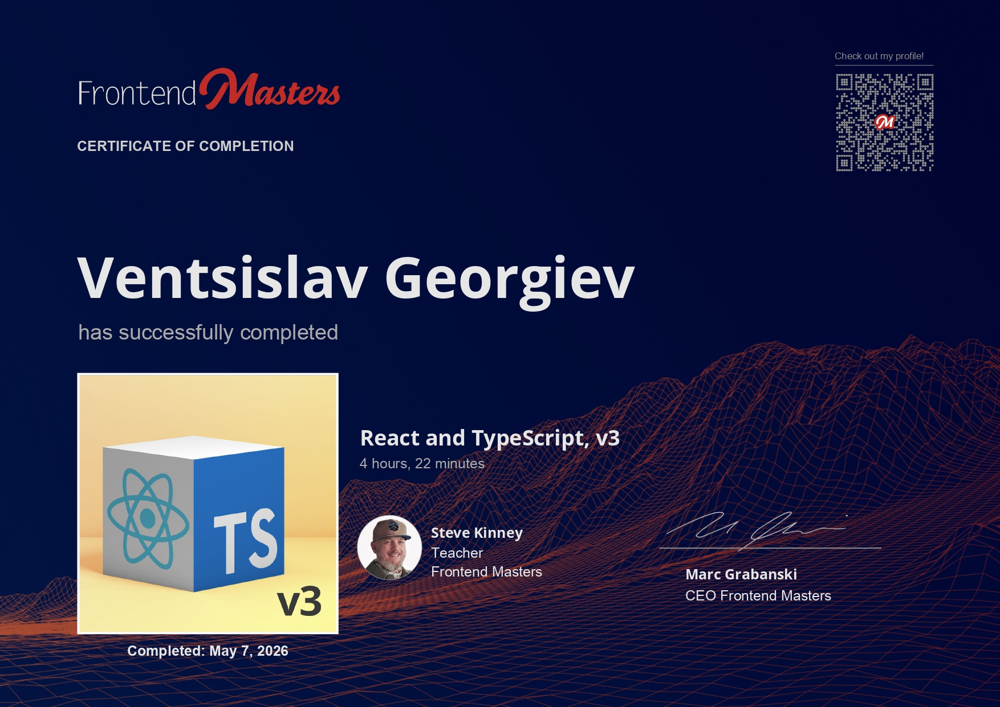

# React + TypeScript, v3



## Course

This project follows the Frontend Masters course **React + TypeScript, v3**.

Course link: <https://frontendmasters.com/courses/react-typescript-v3/>

## Description

Write higher-quality code with React and TypeScript. This course focuses on adding type safety to React hooks, component APIs, and design-system patterns so applications become easier to maintain as they grow.

The course also explores complex state management with reducers and discriminated unions, runtime API validation with Zod, and practical TypeScript patterns that catch errors earlier while improving the developer experience for a team.

## Project Structure

The course examples and labs are inside:

```txt
src/examples/
```

Shared utilities, components, API helpers, and styles are inside:

```txt
src/common/
```

The example picker script is stored in:

```txt
scripts/
```

The certificate image is stored in:

```txt
certificate/
```

## Examples

This repository is a React + TypeScript playground built with Vite and Storybook. It includes examples for:

- Typed component props and children
- Custom hooks and reusable utilities
- Reducer-driven state management
- Discriminated unions for safer state transitions
- Design-system friendly component typing
- Runtime schema validation with Zod
- Type-level tests and compiler-driven feedback

## Running Storybook

All of the examples are exposed as stories. Run Storybook from this folder:

```bash
npm install
npm run storybook
```

## Running Examples

If Storybook is not working for you, this project includes an interactive example picker.

```bash
npm run examples
```

This launches a menu where you can:

- Use arrow keys to navigate through available examples
- Press Enter to select an example
- Press Ctrl+C or Esc to quit

The CLI updates `index.html` to load the selected example. After selecting an example, start the Vite development server:

```bash
npm run dev
```

## Quality Checks

The project includes scripts for type-checking, linting, formatting, testing, and building:

```bash
npm run typecheck
npm run lint
npm run test
npm run build
```

## Notes

This course folder is focused on TypeScript as a design tool for React applications. The examples are intentionally small and isolated, which makes it easier to compare approaches for hooks, components, reducers, schema validation, and reusable type utilities.
