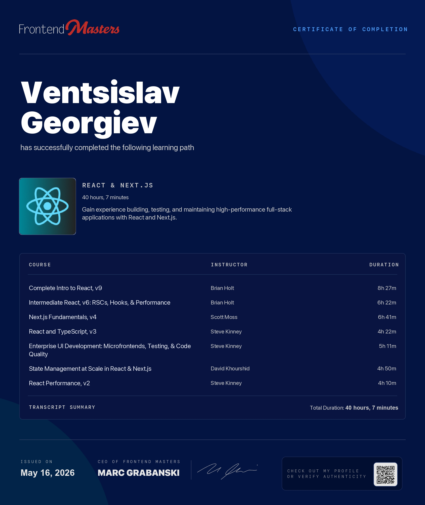

# React and Next.js Frontend Masters Learning Path

This repository collects the projects, exercises, and notes from a seven-part Frontend Masters learning path focused on modern React and Next.js development. Each folder represents a separate course in the path:

- [01-complete-intro-to-react-v9](./01-complete-intro-to-react-v9)
- [02-intermediate-react-v6](./02-intermediate-react-v6)
- [03-next-js-fundamentals-v4](./03-next-js-fundamentals-v4)
- [04-reaact-and-typescript](./04-reaact-and-typescript)
- [05-enterprise-ui](./05-enterprise-ui)
- [06-state-management](./06-state-management)
- [07-react-performance](./07-react-performance)

